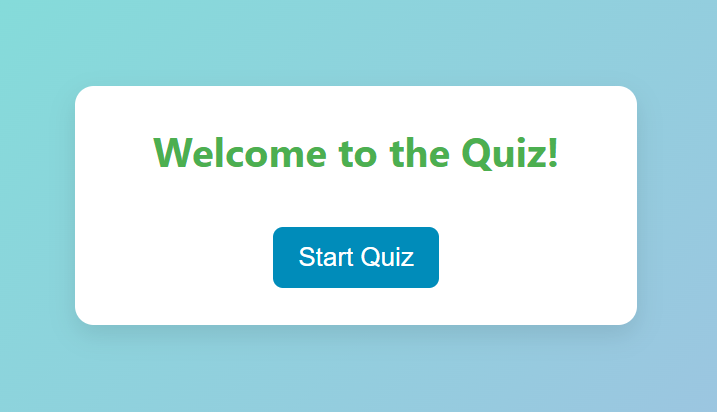
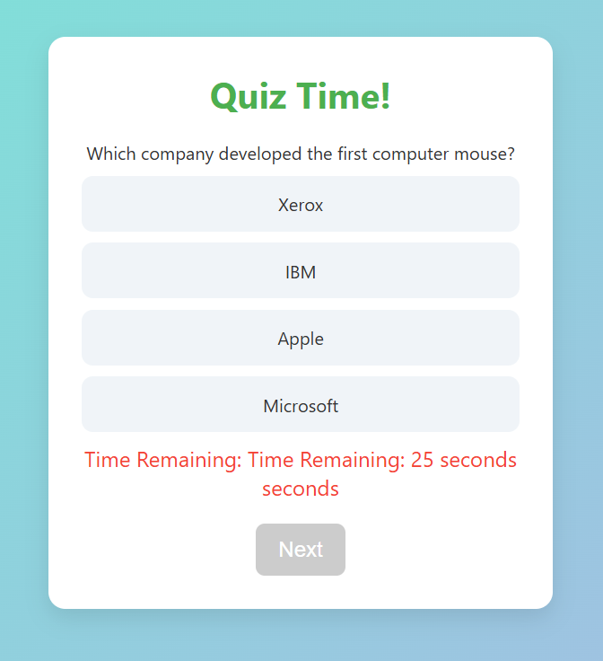
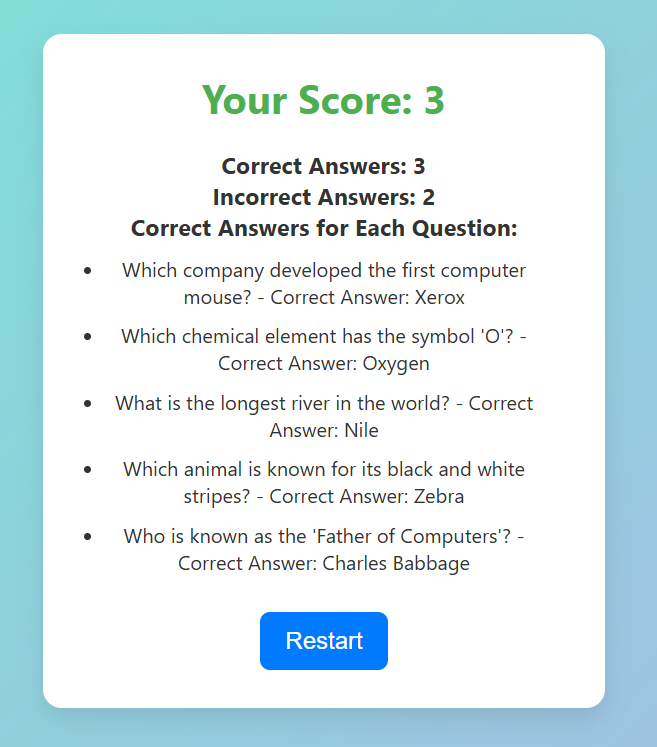

# Quiz App

A simple and interactive quiz application built using HTML, CSS, and JavaScript. This app allows users to test their knowledge on various topics through a series of multiple-choice questions.

## Features

- **User-Friendly Interface:** Clean and responsive design for an engaging user experience.
- **Dynamic Quiz Content:** Questions and answers are loaded dynamically.
- **Score Tracking:** Users can see their scores at the end of the quiz.
- **Feedback:** Immediate feedback on whether the selected answer is correct or incorrect.
- **Timer:** Each question has a countdown timer to add a sense of urgency.
- **Restart Functionality:** Users can restart the quiz at any time.

## Technologies Used

- **HTML5** for the structure.
- **CSS3** for styling.
- **JavaScript** for functionality.

## Usage

1. Open the app in any modern web browser.
2. Click the "Start Quiz" button to begin.
3. Answer the multiple-choice questions within the given time.
4. View your score and correct answers at the end of the quiz.
5. Click "Restart" to take the quiz again.

## How to Run

1. Clone the repository to your local machine.
2. Open the `index.html` file in your preferred web browser.

## File Structure

- `index.html`: The main HTML file that contains the structure of the quiz app.
- `style.css`: The CSS file for styling the quiz app.
- `script.js`: The JavaScript file that contains the logic for the quiz app.

## Screenshots

## License

This project is licensed under the MIT License.
Code With Ajit...
